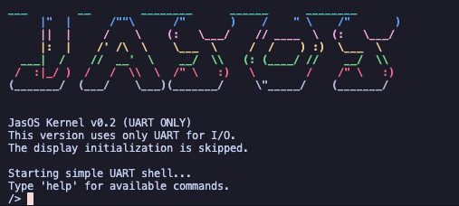
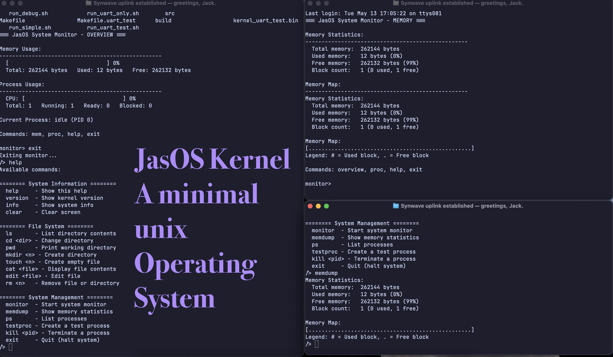

# JasOS Kernel



A simple, educational ARM-based operating system kernel running on QEMU. This is a text-based UART-only version that includes basic OS components.



## Features

- **Memory Management**
  - Dynamic memory allocation and deallocation
  - Block splitting and coalescing
  - Memory usage visualization

- **Process Management**
  - Simple process creation and termination
  - Round-robin scheduling
  - Process states (Ready, Running, Blocked, Terminated)
  - CPU usage tracking

- **File System**
  - In-memory tree-like structure
  - Support for files and directories
  - Commands: ls, cd, mkdir, touch, cat, edit, rm

- **System Monitor**
  - Interactive visualization of system resources
  - Memory usage display
  - Process activity display
  - CPU usage monitoring

## Building

To build JasOS, you'll need an ARM cross-compiler (arm-none-eabi-gcc) and QEMU.

```bash
# Build the kernel
make

# Run the kernel
make run
```

## Available Commands

### Shell Commands
- `help` - Show available commands
- `version` - Show kernel version
- `clear` - Clear screen
- `info` - Show system info
- `exit` - Quit (halt system)

### File System Commands
- `ls` - List directory contents
- `cd <dir>` - Change directory
- `pwd` - Print working directory
- `mkdir <name>` - Create directory
- `touch <name>` - Create empty file
- `cat <file>` - Display file contents
- `edit <file>` - Edit file
- `rm <name>` - Remove file or directory

### Process Management Commands
- `ps` - List processes
- `testproc` - Create a test process
- `kill <pid>` - Terminate a process

### Memory Management Commands
- `memdump` - Show memory statistics

### System Monitor
- `monitor` - Start the system monitor

## System Monitor Commands

When in the system monitor mode, the following commands are available:
- `overview` - Show system overview
- `mem` - Show detailed memory information
- `proc` - Show detailed process information 
- `help` - Show help screen
- `exit` - Exit monitor and return to shell

## Architecture

JasOS is organized into several components:

1. **Core Kernel** - Handles initialization and shell interface
2. **Memory Manager** - Manages heap and allocation
3. **Process Manager** - Handles process creation and scheduling
4. **File System** - Manages file and directory operations
5. **System Monitor** - Provides visualization of system resources

## Using QEMU

To exit QEMU, press Ctrl+A, then X.

## License

This project is for educational purposes only. 